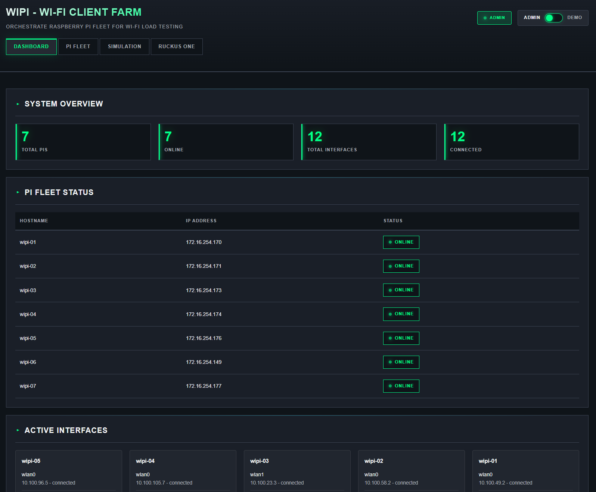
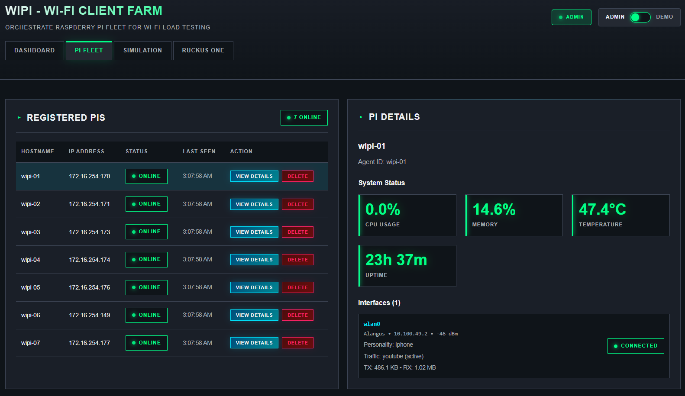
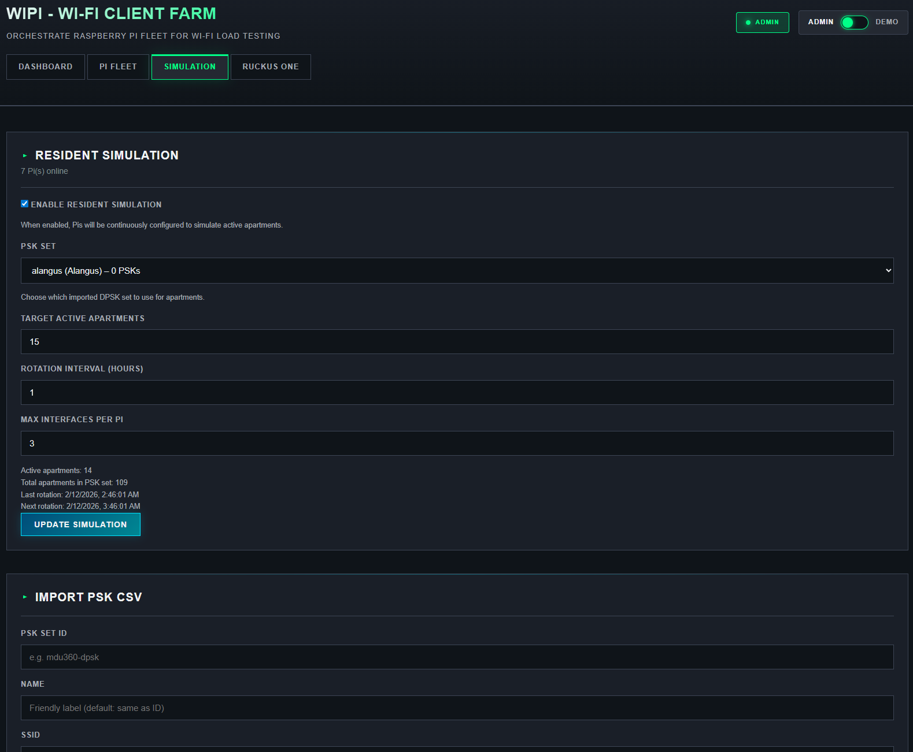
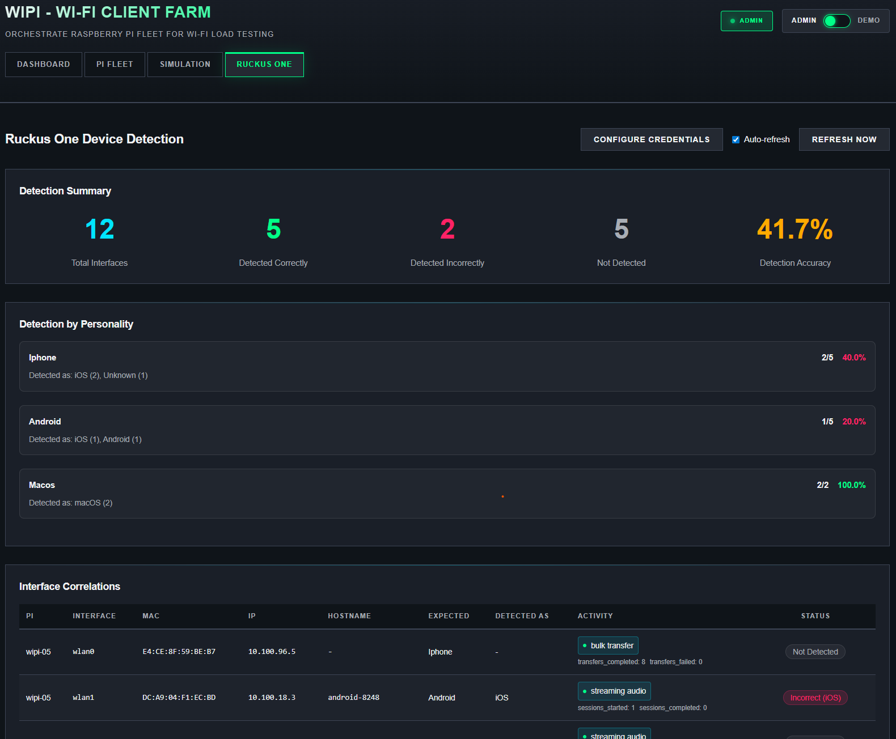
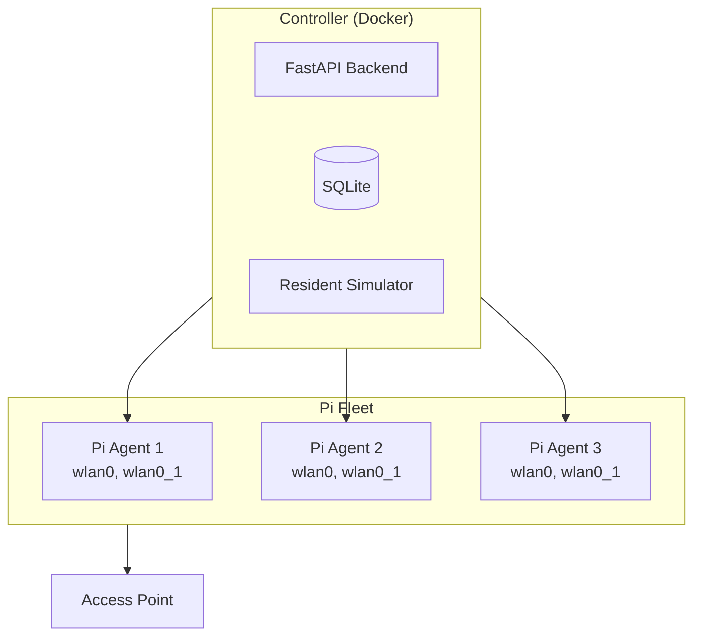

# WiPi - Wi-Fi Client Farm System

**Raspberry Pi-based Wi-Fi load testing with intelligent resident simulation**

WiPi simulates apartment residents connecting to access points, generating traffic, and rotating through different usage patterns. Scale depends on your fleet size and hardware (we've tested with ~15 simultaneous residents so far). Perfect for testing MDU (Multi-Dwelling Unit) Wi-Fi infrastructure, device fingerprinting accuracy, and network performance under realistic conditions.

---

## Table of Contents

- [Features](#-features)
- [Web Interface](#-web-interface)
- [Quick Start](#-quick-start)
- [Authentication](#-authentication)
- [Architecture](#-architecture)
- [Hardware Compatibility](#-hardware-compatibility)
- [Monitoring & Troubleshooting](#-monitoring--troubleshooting)
- [Documentation](#-documentation)

---

## ✨ Features

### Intelligent Resident Simulation
- 🏘️ **Apartment-Based Model** - Simulate real apartment buildings with DPSK/DPSK3 passphrases
- 🔄 **Automatic Rotation** - Residents "move in" and "move out" on configurable schedules
- 🕐 **Time-Aware Traffic** - Different usage patterns for morning, day, and evening
- 📊 **Realistic Load** - Browser sessions, video streaming, file transfers matched to time of day

### Distributed Architecture
- 🥧 **Raspberry Pi Fleet** - Deploy across multiple Pis for scale
- 📡 **Virtual Interfaces** - Multiple Wi-Fi clients per Pi (hardware-dependent)
- 🎯 **Pull-Based Config** - Agents autonomously fetch and apply configurations
- 💪 **Self-Healing** - Automatic recovery from connection failures

### Management & Monitoring
- 🖥️ **Web Dashboard** - React-based UI for complete system control
- 📈 **Real-Time Status** - Monitor all interfaces, traffic, and Pi health
- 🔍 **RUCKUS One Integration** - Track device fingerprinting accuracy
- 📝 **Audit Logging** - Complete trail of all administrative actions

### Security
- 🔐 **Admin Authentication** - Session-based login with bcrypt password hashing
- 🎭 **Demo Mode** - Read-only access for demonstrations
- 🔑 **Agent API Keys** - Secure agent-to-controller communication

---

## 🖼️ Web Interface

The WiPi UI provides four main views:

### Dashboard
System overview with fleet health, interface counts, and active connections. Monitor total Pis, online/offline status, and which interfaces are connected across the fleet.



### Pi Fleet
Detailed view of each Raspberry Pi: hostname, IP, status, and per-interface details (SSID, IP address, traffic type, connection state). Useful for debugging and capacity planning.



### Resident Simulation
Configure and control the resident simulator: import DPSK passphrases from CSV, enable/disable simulation, set target apartments, rotation interval, and max interfaces per Pi. Admin-only.



### Ruckus One
Compare expected device personalities (iPhone, Android, etc.) with RUCKUS One’s fingerprinting results. View detection accuracy and per-interface correlation. Requires RUCKUS One API credentials.



---

## 🚀 Quick Start

### Prerequisites

- **Controller Host:** Linux with Docker and Docker Compose
- **Agent Hosts:** Raspberry Pi 5 (or Pi 4B with limitations - see [Hardware Compatibility](#-hardware-compatibility))
- **Network:** Controller and agents must be routable
- **Wi-Fi:** Access points with DPSK, DPSK3, or PSK authentication

### 1. Clone and Run Setup

```bash
git clone https://github.com/alekm/wipi.git
cd wipi

# One-time setup: generates credentials, creates .env
./scripts/wipi-init

# Build and start controller and UI
docker compose up -d --build

# Verify
docker compose ps
docker compose logs -f controller
```

**UI:** http://localhost:8080  
**API Docs:** http://localhost:8000/docs

### 2. Deploy Agents to Raspberry Pis

Deploy scripts use `AGENT_API_KEY` and `CONTROLLER_URL` from `.env`:

```bash
# Single Pi
./scripts/deploy-to-pi.sh 192.168.1.100 wipi-01

# Multiple Pis (create pi-list.txt: "ip hostname" per line)
./scripts/deploy-to-multiple-pis.sh pi-list.txt

# Override controller URL
CONTROLLER_URL=http://192.168.1.50:8000 ./scripts/deploy-to-pi.sh 192.168.1.100 wipi-01
```

**Pi list format** (`pi-list.txt`):
```
192.168.1.100 wipi-01
192.168.1.101 wipi-02
192.168.1.102 wipi-03
```

### 3. Import DPSK Passphrases

1. Export DPSK/DPSK3 CSV from your Wi-Fi controller (e.g., RUCKUS One)
2. In the UI, go to **Simulation** → **Import PSK CSV**
3. Upload the file and provide ID, Name, and SSID

### 4. Start Resident Simulation

1. In **Simulation**, configure:
   - **Enable Simulation:** ON
   - **PSK Set:** Select your imported set
   - **Target Active Apartments:** Number of simultaneous connections
   - **Rotation Interval:** Hours between rotations
   - **Max Interfaces per Pi:** Limit per device

2. Click **Update Simulation**

The system distributes apartments across Pis, creates virtual interfaces, connects to APs, and runs traffic patterns.

---

## 🔐 Authentication

### Admin Access

**Default password:** `Ruckus123!` (change before production)

**Login:**
1. Open http://localhost:8080 (starts in Demo mode)
2. Click the Admin/Demo toggle in the header
3. Enter password in the modal
4. Session lasts 24 hours

**Change password:**
```bash
# Regenerate credentials (recommended)
./scripts/wipi-init
# Choose "Regenerate credentials" to set a new admin password with bcrypt

# Or manually: generate hash and set in .env
echo -n "YourNewPassword" | sha256sum
# Add WIPI_ADMIN_PASSWORD_HASH=... to .env, then:
docker compose up -d --build
```

### Agent API Key

**Default key** is in the repo; generate a new one for production:

```bash
openssl rand -hex 32
```

Set `AGENT_API_KEY` in `.env` and restart the controller. Update `/etc/wipi/agent_config.yaml` on each Pi and restart the agent service.

---

## 📊 Architecture



---

## 🛠️ Hardware Compatibility

| Platform | VIF Support | Notes |
| -------- | ----------- | ----- |
| **Raspberry Pi 5** | ✅ Full | 4–8 clients per Pi (built-in + USB adapters) |
| **Raspberry Pi 4B** | ⚠️ Limited | Use base interface only (1 client) or add USB Wi-Fi |

**USB Wi-Fi adapters (tested):**
- MediaTek MT7612U (2 interfaces)
- Ralink RT5572 (2 interfaces)
- Atheros AR9271 (2 interfaces)

---

## 📈 Monitoring & Troubleshooting

### Dashboard Metrics
- Total Pis and online count
- Interface counts (connected, connecting, error)
- Per-Pi status and active interfaces

### Audit Logs
```bash
docker compose logs controller | grep "wipi.audit"
```

### Pi Not Registering
```bash
# On Pi
sudo systemctl status wipi-agent
journalctl -u wipi-agent -f
ping <controller-ip>
```

### Interface Not Connecting
```bash
iw dev
wpa_cli -i wlan0_1 status
ip addr show wlan0_1
```

### VIF Creation Fails
```bash
iw phy phy0 info | grep -A 10 "interface combinations"
# Reduce max_interfaces_per_pi or add USB Wi-Fi adapters
```

---

## 📚 Documentation

- **[QUICKSTART.md](QUICKSTART.md)** - Minimal setup guide
- **[docs/DEPLOYMENT_GUIDE.md](docs/DEPLOYMENT_GUIDE.md)** - Raspberry Pi deployment
- **[docs/PLATFORM_COMPATIBILITY.md](docs/PLATFORM_COMPATIBILITY.md)** - Other Linux distributions
- **API:** http://localhost:8000/docs (when controller is running)

---

## 🤝 Contributing

```bash
git clone https://github.com/alekm/wipi.git
git checkout -b feature/your-feature
# Make changes, commit, push, open PR
```

---

## 📄 License

MIT License - see [LICENSE](LICENSE)

---

## 🙏 Acknowledgments

Built for testing **RUCKUS** MDU 360 and RUCKUS One. Supports **DPSK** and **DPSK3** authentication.
