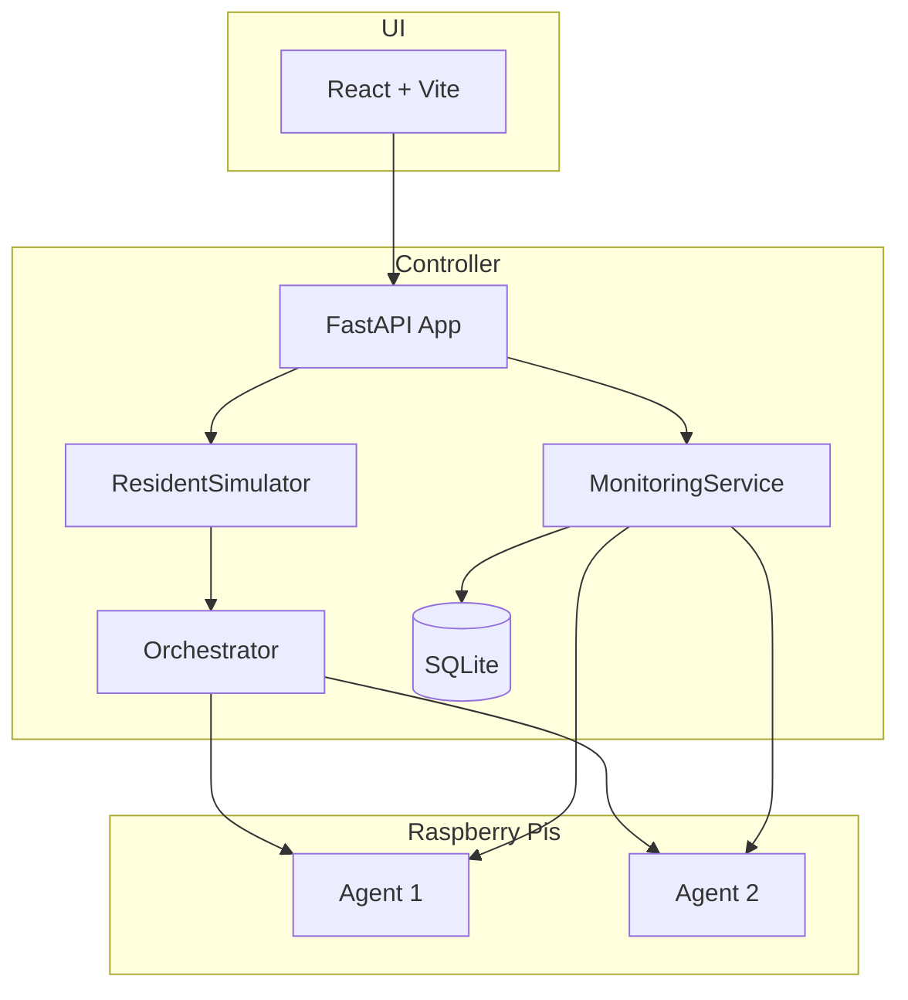

# WiPi Codebase Audit and Improvement Plan

**Last audit:** 2026-02-11

## Architecture Summary

---

## ✅ Resolved (Previous Audit Items)

### 1. Credential Handling

**Status: DONE**

- `wipi-init` script generates `AGENT_API_KEY`, prompts for admin password, optionally `WIPI_ENCRYPTION_KEY` and `CONTROLLER_URL`
- Writes `.env`; `deploy-to-pi.sh` sources it
- Controller and agent log SECURITY WARNING when using default credentials
- `docker-compose.yml` uses `WIPI_ADMIN_PASSWORD_HASH` and `AGENT_API_KEY` from env

### 2. Rate Limiter

**Status: DONE**

- `controller/src/limiter.py` provides shared limiter (avoids circular imports)
- Auth routes use `@limiter.limit("5/minute")` on login, `@limiter.limit("10/minute")` on logout
- `SlowAPIMiddleware` attached to app in `main.py`

### 3. CORS Configuration

**Status: DONE**

- `CORS_ORIGINS` env var; `*` by default; comma-separated for production
- `_get_cors_origins()` in `main.py` splits and parses

### 4. Agent Port in Controller

**Status: DONE**

- Agent status returns `api_port` in capabilities (`agent/src/api/status.py`)
- Orchestrator and monitoring use `_get_agent_url()` with `caps.get("api_port", 8080)`
- Capabilities updated from status poll; controller uses correct port

### 5. VIF Feature Flag

**Status: DONE**

- `enable_vif` config flag; `ENABLE_VIF` env var
- Dead code removed; VIF logic behind flag with clear comment

### 6. Scenario Cleanup and Gitignore

**Status: DONE**

- `controller/scenarios/*.yaml` in `.gitignore` with `!example_*.yaml` and `!resident-sim.yaml`
- Only `example_basic_load.yaml`, `example_simple_test.yaml`, `resident-sim.yaml` tracked

### 7. ResidentSim Defaults

**Status: DONE**

- `ResidentSimulationConfig` and `ResidentSimulationConfigModel` both use 64/8
- API schema and DB model aligned

### 8. Auth UX (Login Modal)

**Status: DONE**

- `LoginModal.jsx` component; `AuthContext` uses it instead of `prompt()`/`alert()`

### 9. API Client Error Handling

**Status: DONE**

- `parseErrorResponse()` handles FastAPI validation arrays and string detail
- UI shows clear error messages

### 10. Health Check

**Status: DONE**

- `GET /health/ready` runs `SELECT 1` for DB connectivity; returns 503 on failure
- Suitable for Docker/k8s readiness probes

### 11. Structured Logging

**Status: DONE**

- `LOG_FORMAT=json` env var; uses `python-json-logger` when set

### 12. deploy-to-debian.sh Agent API Key

**Status: DONE**

- `.env` sourcing added (like `deploy-to-pi.sh`)
- `agent_api_key` in agent_config.yaml and systemd Environment
- `HOSTNAME`, `CONTROLLER_URL`, `AGENT_API_KEY` passed to remote via ssh env

### 13. Agent Registration api_port

**Status: DONE**

- `api_port` added to registration capabilities so controller has correct port immediately

### 14. Password Hashing (bcrypt)

**Status: DONE**

- Switched from SHA-256 to bcrypt via passlib
- Backward compatible: still accepts legacy SHA-256 hashes
- `wipi-init` generates bcrypt when passlib is installed; falls back to SHA-256 otherwise

### 15. Interface Name Validation

**Status: DONE**

- `InterfaceManager` validates all interface names with `^[a-zA-Z0-9_]+$` before passing to `iw`/`ip`
- `InterfaceConfig` Pydantic validator rejects invalid names at config parse time

---

## 🔶 Remaining Items

### 16. HTTPS for Controller-to-Agent

**Issue:** Orchestrator and monitoring use `http://` only. For cross-network deployments, traffic is unencrypted.

**Recommendation:** Document as known limitation. Add `AGENT_SCHEME` (http/https) and per-Pi cert support if TLS becomes a requirement.

### 17. Default Credentials Fallbacks

**Issue:** Fallback defaults remain in `controller/src/main.py`, `agent/src/main.py`, `docker-compose.yml`, and `deploy-to-pi.sh` for backward compatibility and demo use. `wipi-init` generates new credentials, but unsuspecting users may skip it.

**Recommendation:** Mitigated with startup warnings. Consider failing startup when unset in production mode (future enhancement).

### 18. Unit/Integration Tests

**Issue:** No pytest or similar. Only manual and hardware testing.

**Recommendation:** Deferred per project direction. Add if/when maintenance burden justifies it.

### 19. API Versioning (Deferred)

**Issue:** Routes are `/api/...` with no version prefix.

**Recommendation:** Low priority; consider `/api/v1/...` for future stability.

---

## Summary Table

| Priority | Category  | Item                          | Status      |
| -------- | --------- | ----------------------------- | ----------- |
| High     | Security  | Credential handling           | ✅ Done     |
| High     | Security  | Auth rate limiter             | ✅ Done     |
| Medium   | Arch      | Agent port in controller      | ✅ Done     |
| Medium   | Code      | VIF feature flag              | ✅ Done     |
| Medium   | Code      | Scenario cleanup / gitignore  | ✅ Done     |
| Medium   | Code      | ResidentSim defaults          | ✅ Done     |
| Medium   | Deploy    | deploy-to-debian + AGENT_API_KEY | ✅ Done |
| Low      | UX        | Login modal                   | ✅ Done     |
| Low      | UX        | API error handling            | ✅ Done     |
| Low      | Ops       | /health/ready                 | ✅ Done     |
| Low      | Ops       | Structured logging            | ✅ Done     |
| Low      | Arch      | Agent registration api_port  | ✅ Done     |
| High     | Security  | Password hashing (bcrypt)    | ✅ Done     |
| High     | Security  | Interface name validation    | ✅ Done     |
| Low      | Arch      | HTTPS controller-agent        | 🔶 Documented |
| Low      | Quality   | Unit tests                    | Deferred    |
| Low      | Arch      | API versioning                | Deferred    |

---

## Suggested Next Steps

1. **deploy-to-debian.sh**: Add `.env` sourcing and `agent_api_key` to agent config (and/or doc that users must set env before deploy).
2. **Optional:** Add `api_port` to agent registration capabilities.
3. **Documentation:** Ensure QUICKSTART and DEPLOYMENT_GUIDE mention `deploy-to-debian.sh` and `.env` usage.
