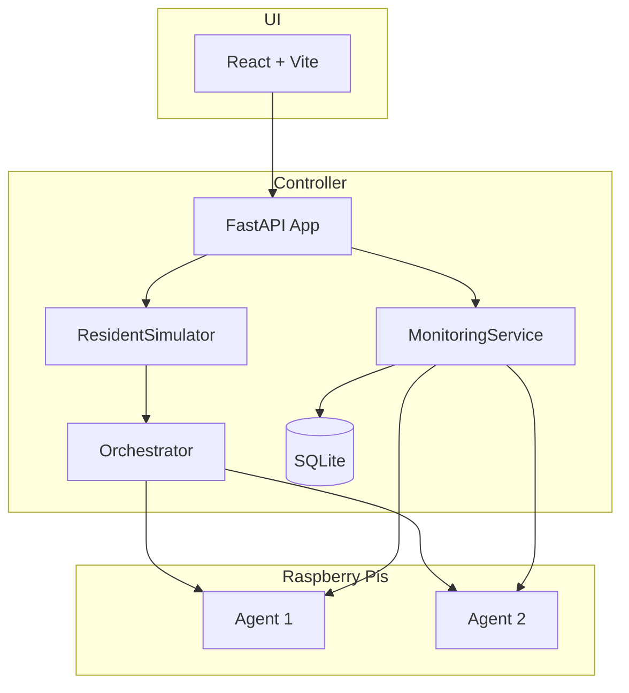

# WiPi Codebase Audit and Improvement Plan

## Architecture Summary



---

## Critical Security Issues

### 1. Hardcoded Default Credentials

**Issue:** Same default API key and password hash appear in 6+ places.

| Location                                                        | Credential                                     |
| --------------------------------------------------------------- | ---------------------------------------------- |
| [controller/src/main.py](controller/src/main.py) L63            | `AGENT_API_KEY` default                        |
| [agent/src/main.py](agent/src/main.py) L55                      | `AGENT_API_KEY` default                        |
| [docker-compose.yml](docker-compose.yml) L18                    | `AGENT_API_KEY` fallback                       |
| [scripts/deploy-to-pi.sh](scripts/deploy-to-pi.sh) L16          | `AGENT_API_KEY` default                        |
| [controller/src/api/auth.py](controller/src/api/auth.py) L28-30 | `ADMIN_PASSWORD_HASH` (SHA256 of "Ruckus123!") |

**Recommendation:** Require explicit credential generation on first run. Fail startup if `AGENT_API_KEY` is unset in production. Add a `wipi-init` script that generates and writes credentials to `.env`.

### 2. CORS and Rate Limiting

- **CORS:** [controller/src/main.py](controller/src/main.py) L192: `allow_origins=["*"]` is too permissive for production.
- **Rate limiter:** [controller/src/api/auth.py](controller/src/api/auth.py) creates its own `Limiter` instance that is never attached to the app. The main app's limiter in [controller/src/main.py](controller/src/main.py) L185 is in `app.state`, but auth routes use a different limiter—login rate limiting may not work correctly.

**Recommendation:** Use `app.state.limiter` from main for auth routes. Add `CORS_ORIGINS` env var with sensible default (e.g. same-origin + UI origin).

---

## Architectural Gaps

### 3. Agent Port Hardcoded

**Issue:** Controller assumes agent port 8080 everywhere:

- [controller/src/services/orchestrator.py](controller/src/services/orchestrator.py) L354, 408, 453: `pi_url = f"http://{pi_info.ip_address}:8080"`
- [controller/src/services/monitoring.py](controller/src/services/monitoring.py) L156: same pattern

Agent supports `API_PORT` via config, but controller has no way to know it.

**Recommendation:**

- Add `api_port` to `PiRegistration` capabilities and agent status.
- Store in `PiModel` (or in capabilities JSON).
- Use `capabilities.get("api_port", 8080)` when building Pi URLs.

### 4. No HTTPS for Controller-to-Agent Communication

**Issue:** Orchestrator and monitoring use `http://` only. For deployments across networks, this is insecure.

**Recommendation:** Add `AGENT_SCHEME` (http/https) and `AGENT_PORT` env vars. Document that HTTPS requires per-Pi certs or internal CA.

---

## Code Quality and Cleanup

### 5. Dead Code in Interface Manager

**Issue:** [agent/src/core/interface_manager.py](agent/src/core/interface_manager.py) L41-44: VIF is disabled with early `return 1`. All code from L46-80+ is unreachable.

```python
# TEMPORARY: Disable VIF support entirely due to stability issues
self._vif_max_count_cache[interface] = 1
return 1
# ... dead code below ...
```

**Recommendation:** Either remove the dead block and add a `# VIF disabled` comment, or reintroduce a feature flag (e.g. `ENABLE_VIF=true`) so the logic can be re-enabled.

### 6. Duplicate Scenarios

**Issue:** [controller/scenarios/](controller/scenarios/) contains both canonical and duplicate scenario files:

- `basic_load_test.yaml` and `basic-load-test-001.yaml` (same content)
- `simple_test.yaml` and `simple-test-001.yaml`
- `heavy_traffic.yaml` and `heavy-traffic-001.yaml`
- `multi-test.yaml` and `test-multi.yaml`
- 10+ UUID-named files (e.g. `12221674-e8b5-47f0-8481-d226eb85e416.yaml`) from resident simulator

**Recommendation:**

- Keep one canonical example per scenario type (e.g. `example_basic_load.yaml`).
- Add `controller/scenarios/*.yaml` to `.gitignore` with `!controller/scenarios/example_*.yaml` so only examples are tracked.
- Resident-sim UUID scenarios should be generated in a temp/scratch dir or explicitly ignored.

### 7. Gitignore Mismatch

**Issue:** `.gitignore` has `scenarios/*.yaml` (root-level) but scenarios live in `controller/scenarios/`. Root `scenarios/` does not exist, so `controller/scenarios/` is not ignored.

**Recommendation:** Add `controller/scenarios/*.yaml` and `!controller/scenarios/example_*.yaml` to `.gitignore`.

### 8. ResidentSimulationConfig vs DB Defaults

**Issue:** [controller/src/services/resident_simulator.py](controller/src/services/resident_simulator.py) L26-30 in-memory defaults differ from DB model:

- `ResidentSimulationConfig`: `target_active_apartments=11`, `max_interfaces_per_pi=3`
- `ResidentSimulationConfigModel`: `target_active_apartments=64`, `max_interfaces_per_pi=8`

`_load_config()` loads from DB, but if DB is empty or new, the dataclass defaults may be used inconsistently.

**Recommendation:** Align defaults. Prefer DB model values as source of truth; ensure `_load_config()` uses DB defaults when no row exists.

---

## UI and UX

### 9. Auth UX Uses `prompt()` and `alert()`

**Issue:** [ui/src/context/AuthContext.jsx](ui/src/context/AuthContext.jsx) L136: `prompt('Enter admin password:')` and L140: `alert(result.error)` are poor UX.

**Recommendation:** Add a login modal component (e.g. `LoginModal.jsx`) with a proper form, validation, and error display. Replace `prompt`/`alert` with modal-based flows.

### 10. API Client Error Handling

**Issue:** [ui/src/api/client.js](ui/src/api/client.js) L19: `error.error || error.detail`—FastAPI returns `detail` as string or array. Nested structure may not be surfaced correctly.

**Recommendation:** Normalize error extraction (e.g. `Array.isArray(detail) ? detail.join(' ') : detail`) and ensure UI shows clear messages.

---

## Additions and Enhancements

### 11. Tests

**Issue:** No unit or integration tests. Only [scripts/test-ruckus-api.py](scripts/test-ruckus-api.py) exists.

**Recommendation:**

- Add `pytest` and `pytest-asyncio` to controller/agent requirements.
- Start with: shared model validation tests, `DesiredConfigManager` hashing, `PskManager.resolve_psk`, and critical API routes (e.g. `/api/pis/register`, `/api/auth/login`).
- Optionally add Playwright or similar for UI smoke tests.

### 12. Health Check

**Issue:** `/health` returns `{"status": "healthy"}` only. No DB or service checks.

**Recommendation:** Add `/health/ready` that verifies DB connectivity and optionally monitoring service state. Use for k8s/Docker health probes.

### 13. API Versioning

**Issue:** Routes are `/api/...` with no version. Future changes may break clients.

**Recommendation:** Consider `/api/v1/...` prefix. Low priority but useful for long-term stability.

### 14. Structured Logging

**Issue:** Plain text logs (`%(asctime)s - %(name)s - %(levelname)s - %(message)s`). Hard to parse in aggregators.

**Recommendation:** Add `LOG_FORMAT=json` env var; when set, use `python-json-logger` or similar for JSON output. Improves ELK/Datadog integration.

### 15. Pi Registration Capabilities

**Issue:** Agent registration sends minimal capabilities: `max_interfaces`, `base_interface`. Status endpoint returns richer `capabilities` (interfaces, total_capacity), but registration does not. Monitoring updates capabilities from status; initial registration is sparse.

**Recommendation:** Have agent include full capabilities (from mock or status) in registration so controller has complete data before first monitoring poll.

---

## Summary Table

| Priority | Category  | Item                                         |
| -------- | --------- | -------------------------------------------- |
| High     | Security  | Remove/replace hardcoded default credentials |
| High     | Security  | Fix auth rate limiter attachment             |
| Medium   | Arch      | Configurable agent port in controller        |
| Medium   | Code      | Remove dead VIF code or add feature flag     |
| Medium   | Code      | Scenario cleanup and gitignore               |
| Medium   | Code      | ResidentSim config default alignment         |
| Low      | UX        | Login modal instead of prompt/alert          |
| Low      | Additions | Basic pytest suite                           |
| Low      | Additions | Enhanced health check                        |
| Low      | Additions | Structured logging option                    |

---

## Suggested Implementation Order

1. **Security:** Credential handling and rate limiter fix.
2. **Agent port:** Add `api_port` to capabilities and use it in orchestrator/monitoring.
3. **Cleanup:** Remove dead code, fix gitignore, deduplicate scenarios.
4. **Config:** Align ResidentSim defaults.
5. **UI:** Login modal.
6. **Tests:** Core model and API tests.
7. **Ops:** Health check and structured logging.
